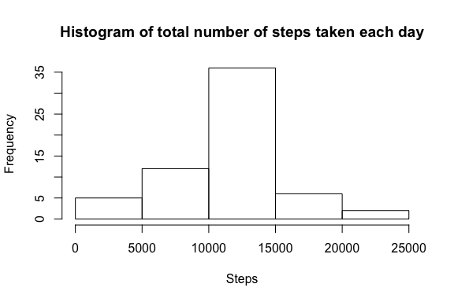

# Reproducible Research: Peer Assessment 1


## Loading and preprocessing the data
In this document we present the exploratory analysis performed on the 
[Activity monitoring dataset](https://d396qusza40orc.cloudfront.net/repdata%2Fdata%2Factivity.zip) 
as a part of Peer Review Assesment for the *Reproducible Research* course on Coursera. 


```r
activity <- read.csv(unz("activity.zip", "activity.csv"), 
                     header = T, 
                     colClasses = c("integer", "character", "integer"))
str(activity)
```

```
## 'data.frame':	17568 obs. of  3 variables:
##  $ steps   : int  NA NA NA NA NA NA NA NA NA NA ...
##  $ date    : chr  "2012-10-01" "2012-10-01" "2012-10-01" "2012-10-01" ...
##  $ interval: int  0 5 10 15 20 25 30 35 40 45 ...
```


## What is mean total number of steps taken per day?
We will ignore the missing values initially.

```r
# Remove missing values
activity_nonNA <- subset(activity, is.na(steps) == F)
```

Calculate the total number of steps taken each day

```r
daily_totals <- tapply(activity_nonNA$steps, activity_nonNA$date, sum)
print(daily_totals)
```

```
## 2012-10-02 2012-10-03 2012-10-04 2012-10-05 2012-10-06 2012-10-07 
##        126      11352      12116      13294      15420      11015 
## 2012-10-09 2012-10-10 2012-10-11 2012-10-12 2012-10-13 2012-10-14 
##      12811       9900      10304      17382      12426      15098 
## 2012-10-15 2012-10-16 2012-10-17 2012-10-18 2012-10-19 2012-10-20 
##      10139      15084      13452      10056      11829      10395 
## 2012-10-21 2012-10-22 2012-10-23 2012-10-24 2012-10-25 2012-10-26 
##       8821      13460       8918       8355       2492       6778 
## 2012-10-27 2012-10-28 2012-10-29 2012-10-30 2012-10-31 2012-11-02 
##      10119      11458       5018       9819      15414      10600 
## 2012-11-03 2012-11-05 2012-11-06 2012-11-07 2012-11-08 2012-11-11 
##      10571      10439       8334      12883       3219      12608 
## 2012-11-12 2012-11-13 2012-11-15 2012-11-16 2012-11-17 2012-11-18 
##      10765       7336         41       5441      14339      15110 
## 2012-11-19 2012-11-20 2012-11-21 2012-11-22 2012-11-23 2012-11-24 
##       8841       4472      12787      20427      21194      14478 
## 2012-11-25 2012-11-26 2012-11-27 2012-11-28 2012-11-29 
##      11834      11162      13646      10183       7047
```

Plot the histogram of total number of steps taken each day.

```r
hist(daily_totals, main = "Histogram of total number of steps taken each day", 
     xlab = "Steps")
```

 

Here are the **mean** and **median** total steps taken per day.

```r
# Compute mean, median and save them into a dataframe
summarySteps <- data.frame(mean = mean(daily_totals), 
                           median = median(daily_totals))
summarySteps
```

```
##    mean median
## 1 10766  10765
```
 

## What is the average daily activity pattern?
Calculate the average number of steps taken in an interval, averaged across all 
days.

```r
avgStepsPerInterval <- tapply(activity_nonNA$steps, 
                              activity_nonNA$interval, mean)
head(avgStepsPerInterval)
```

```
##       0       5      10      15      20      25 
## 1.71698 0.33962 0.13208 0.15094 0.07547 2.09434
```

Plot of 5-minute interval and the average number of steps in that interval across all days.

```r
plot(as.integer(names(avgStepsPerInterval)), avgStepsPerInterval, type = "l", 
     main = "Average number of steps per interval",
     xlab = "Interval", ylab = "Average number of steps")
```

 

Find out which 5-minute interval contains the maximum number of steps. 

```r
names(which.max(avgStepsPerInterval))
```

```
## [1] "835"
```


## Imputing missing values
Here's the total number of missing values in the dataset. 

```r
length(which(is.na(activity$steps) == T))
```

```
## [1] 2304
```

In order to fill up missing values, we will use the mean for that 5-minute interval. We will create a new data set with the missing values filled up. For this, we will use *avgStepsPerInterval* calculated in the previous section.

```r
activityFilled <- activity
for (i in 1:nrow(activityFilled)) {
        if (is.na(activityFilled[i, 1])) {
                index <- as.character(activityFilled[i, 3])
                activityFilled[i, 1] <- avgStepsPerInterval[index]             
        }
}
head(activityFilled)
```

```
##     steps       date interval
## 1 1.71698 2012-10-01        0
## 2 0.33962 2012-10-01        5
## 3 0.13208 2012-10-01       10
## 4 0.15094 2012-10-01       15
## 5 0.07547 2012-10-01       20
## 6 2.09434 2012-10-01       25
```

Here's a histogram of mean total number of steps taken each day (with missing values filled in).

```r
daily_totals_new <- tapply(activityFilled$steps, activityFilled$date, sum)
hist(daily_totals_new, main = "Histogram of total number of steps taken each day", 
     xlab = "Steps")
```

 

The **mean** and **median** values are as folows.

```r
mean(daily_totals_new)
```

```
## [1] 10766
```

```r
median(daily_totals_new)
```

```
## [1] 10766
```

Let's compare the mean and median between the datasets without missing values and the one with missing values filled in.

```r
summarySteps <- rbind(summarySteps, c(mean(daily_totals_new), 
                                      median(daily_totals_new)))
rownames(summarySteps) <- c("NA-ignored", "NA-filled")
summarySteps
```

```
##             mean median
## NA-ignored 10766  10765
## NA-filled  10766  10766
```

They are same.

## Are there differences in activity patterns between weekdays and weekends?
First, let's find out whether the given observation belongs to a weekday or a weekend.

```r
# Find day of the week
days <- weekdays(strptime(activityFilled$date, format = "%F"))

# convert day of the week into a "weekday" or a "weekend"
weekends <- which(days %in% c("Saturday", "Sunday"))
days[weekends] <- "weekend"
days[-weekends] <- "weekday"
days <- as.factor(days)
activityFilled <- cbind(activityFilled, days)
```

Let's compare average number of steps taken for each 5-minute interval on weekdays and weekends.

```r
library(lattice)
library(reshape2)
# Compute interval means for each type of day
iM <- tapply(activityFilled$steps, 
             list(activityFilled$interval, activityFilled$days), 
             mean)
# Reshape the dataframe so that we can plot it
iMeans <- melt(iM)
names(iMeans) <- c("interval", "day", "steps")
xyplot(steps ~ interval | day, data = iMeans, type = "l", xlab = "Interval", 
       ylab = "Average number of steps", 
       main = "Average number of steps per interval (Weekdays vs. Weekends)",
       layout = c(1, 2),
       panel = function(x, y, ...){
               panel.xyplot(x, y, ...)
               # Add a horizontal line at the mean
               panel.abline(h = mean(y), lty = 2)
       })
```

 
